# 大模型推理序列并行

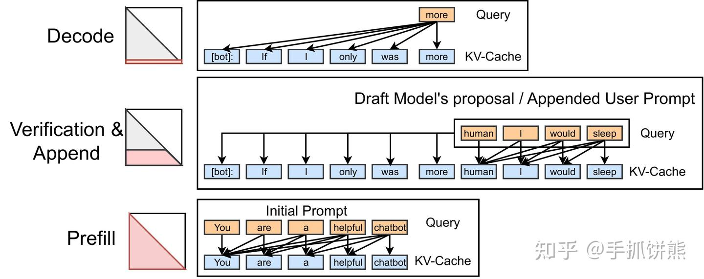

1. Prefill阶段：Prefill阶段和训练的前向比较类似，可以使用交换kv的RingAttention；
2. Decode阶段：Decode阶段q的token数量为1，k和v的数量很大，此时就不适合RingAttention那种交换k和v的方式，该阶段适合交换q的分布式Attention；
3. Prefix-Cache阶段：Prefix-Cache场景，q数量是N，k和v的数量是M，此时采用交换q还是交换kv不确定，具体需要根据通信和计算负载，但一般情况交换q比较适合。

## 分块attention

### Flashattention

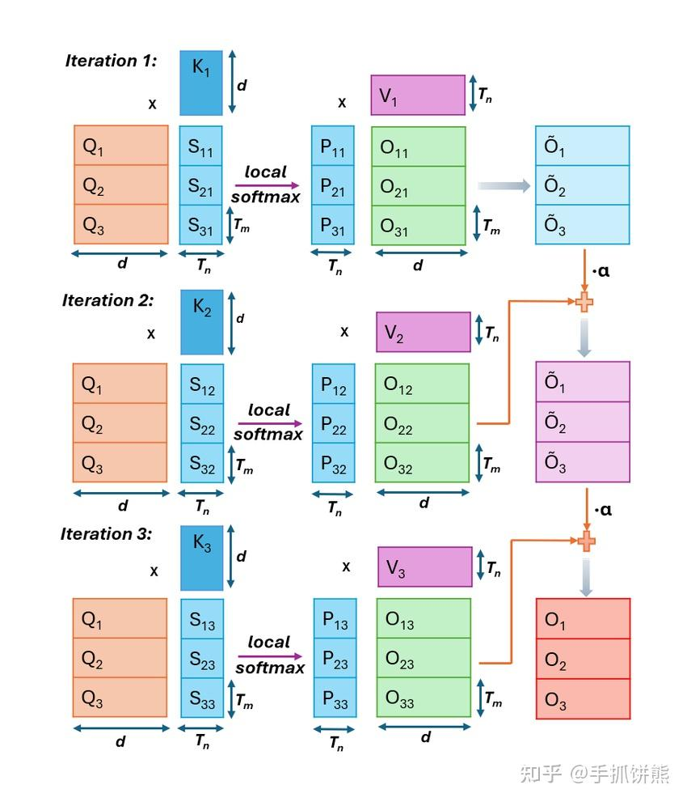

### Hydragen

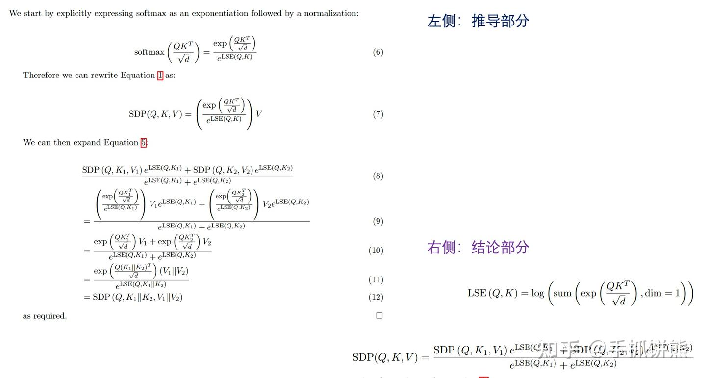

### FlashInfer实现

与上述Hydragen的分块attention类似的是，FlashInfer也提供了分块attention的实现，我们从接口看，输入输出基本是一样的。

## Prefill序列并行

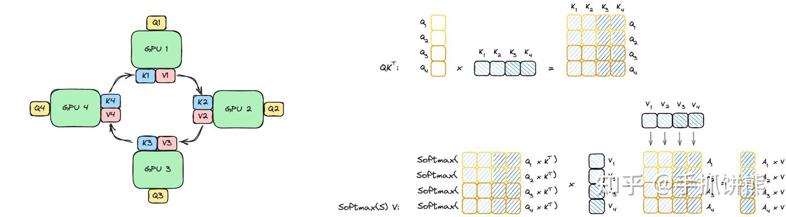

分布式attention：交换q和交换kv

RingAttention采用的是交换kv。
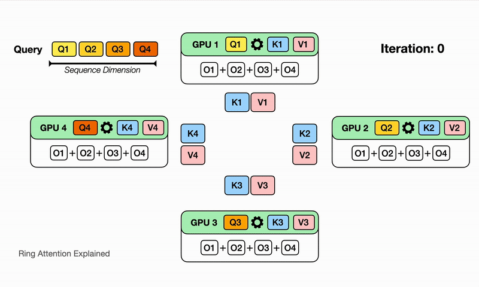

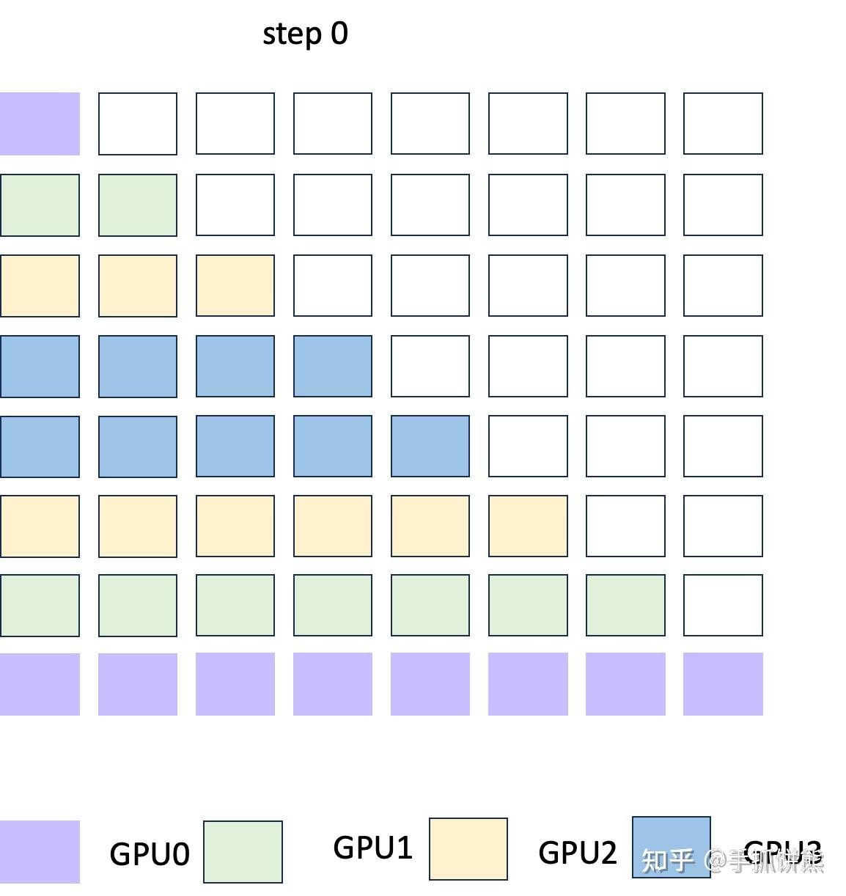

RingAttention还涉及到一个负载均衡的问题，这里可以采用如下的数据拆分规则。我们可以看到如上图所示，序列并行的维度为4，此时将数据拆分为8份，rank0拿到的数据是chunk0和chunk7，rank1拿到的数据是chunk6和chunk2。

* 负载均衡
step0
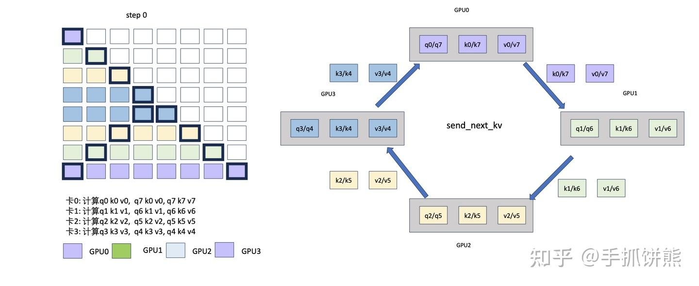
step1
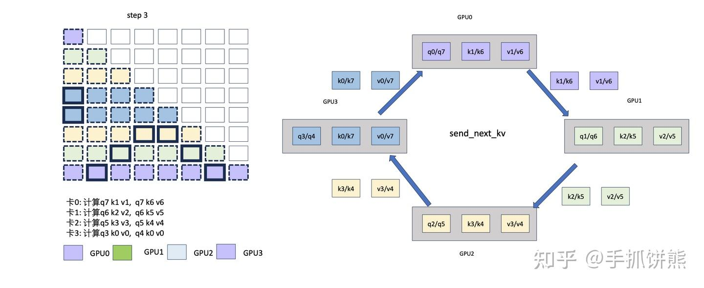
step2
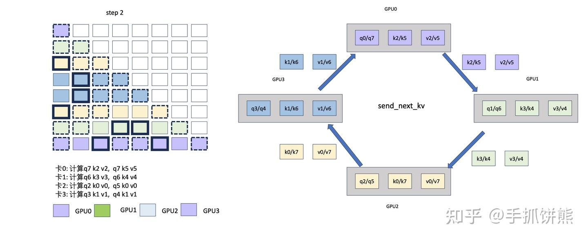
step3

## Decode序列并行

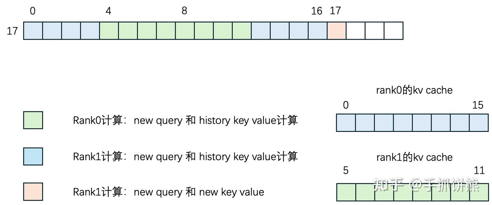

当我们Prefill阶段之后用了RingAttention，之后2张卡各自保存了部分的kv cache，如上图蓝色的是rank0保存的kv cache、绿色的是rank1保存的kv cache。q只有一个，但是q需要分别和rank0以及rank1的kv cache计算。这里其中一个方法是继续重新交换kv，完全按照RingAttention方式继续做一遍，但是通信量太大，且计算量较小，很难通信和计算重叠。

* 通过交换q的方式进行计算
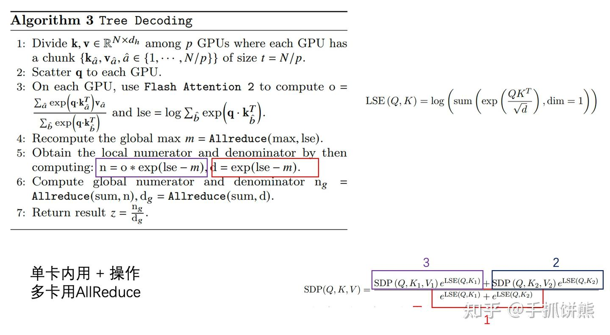
右下角是分块attention得公式结论。单卡内原来的分块attention计算出的out或者lse可以用 + ，但是kv在不同卡上，也就意味着lse和out也在不同的卡上，那么 + 天然的可以转换成Allreduce。

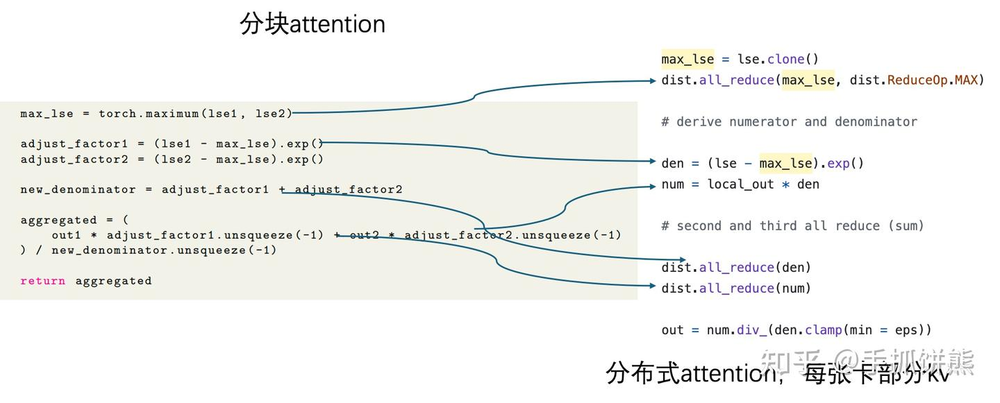

* q的通信也有讲究

Tree-Attention采用直接通信AllGather Q的方式
而meta的论文采用Ring Q的方式，Ring Q最终的Decode阶段attention如下图所示

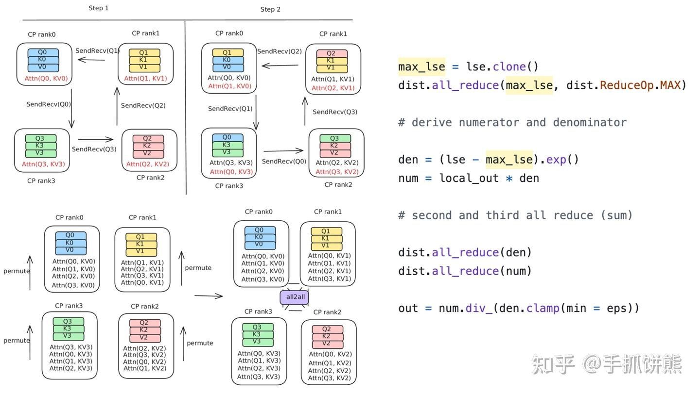

## Prefiex-Cache序列并行

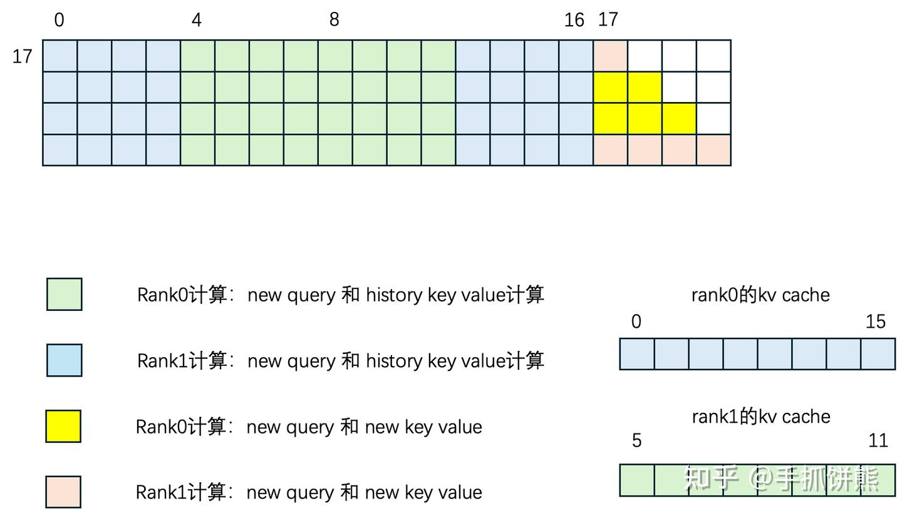

## 思考

1. Ring KV采用的是Ring的方式，本质上是Ring Allgather的方法，这种方式在单机多卡效率很高，但是跨机无法利用所有的带宽；
2. AllReduce可以在多机下利用带宽，机器内用Ring，机器之间用Double Tree，能充分的利用带宽；
3. 相对于AllGather算子，AllReduce算子在使用tree的时候，由于进行了reduce，所以数据量减少了，此时tree的集合通信不仅能充分利用带宽，而且能利用reduce降低tree之间的通信。

# https://zhuanlan.zhihu.com/p/9816504195