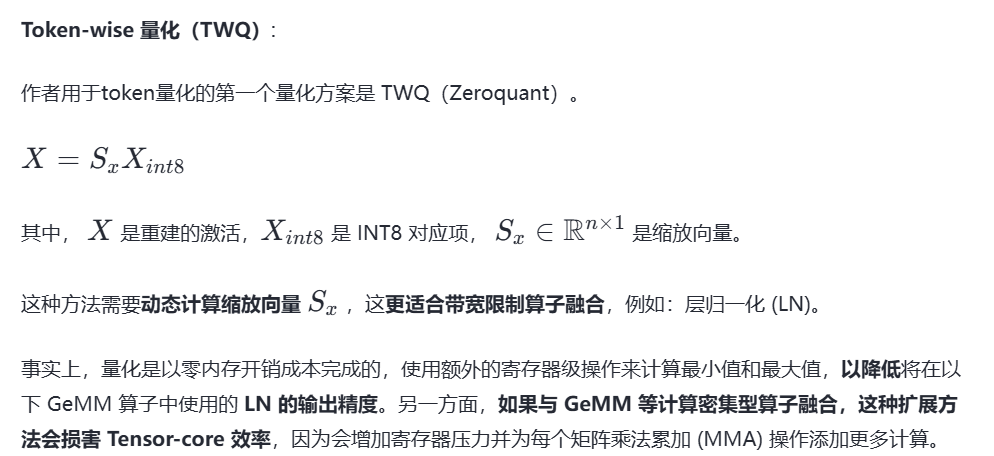
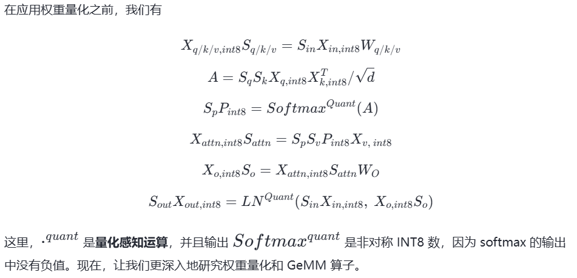

# 量化
https://zhuanlan.zhihu.com/p/11886909512


## LLM.int8()、GPTQ
https://zhuanlan.zhihu.com/p/680212402
* 大模型量化的对象主要有：权重、激活、KV Cache、梯度、优化器等

1. 梯度量化主要在训练场景使用，用于减少反向传播时的计算和通信开销
2. 优化器量化（如：8-Bit Optimizers Via Block-Wise Quantization）也是用于训练场景
3. 仅权重量化，如：W4A16、AWQ及GPTQ中的W4A16，W8A16（权重量化为INT8，激活仍为BF16或FP16）
4. 权重、激活量化，如：SmoothQuant中的W8A8
5. KV Cache INT8 量化

### LLM.int8()
LLM.int8(): 8-bit Matrix Multiplication for Transformers at Scale
这些离群值分布在少量的几个特征中，称为离群特征 (Emergent Features)
LLM.in8() 的思路是把这些特征拿出来单独计算，只对剩余特征做量化。
该方案先做了一个矩阵分解，对绝大部分权重和激活用8bit量化（vector-wise）。对离群特征的几个维度保留16bit，对其做高精度的矩阵乘法。


* 通过三个步骤完成矩阵乘法计算:
1. 从输入的隐含状态中，按列提取异常值 (离群特征，即大于某个阈值的值)。
2. 对离群特征进行 FP16 矩阵运算，对非离群特征进行量化，做 INT8 矩阵运算；
3. 反量化非离群值的矩阵乘结果，并与离群值矩阵乘结果相加，获得最终的 FP16 结果。

虽然 LLM.in8() 带来的性能下降微乎其微，但是这种分离计算的方式拖慢了推理速度。
* Transformer 中受模型大小或 C4 困惑度影响的大量异常值特征的层和所有序列维度的百分比。
当通过困惑度（perplexity）进行测量时，Transformer 所有层中大量异常值特征的出现可以被视为根据困惑度递减的指数函数平滑的出现。


异常值的出现不仅与模型大小有关，还与困惑度有关，而困惑度与多个其他因素有关，例如：使用的训练数据量和数据质量。

* 在 Transformers 中使用 LLM.int8() 只需提前安装 bitsandbytes 即可，使用 LLM.int8() 方法量化transformer模型具体示例如下
```
# 8bit量化：
from transformers import AutoModelForCausalLM
model = AutoModelForCausalLM.from_pretrained(
  'decapoda-research/llama-7b-hf',
  device_map='auto',
  load_in_8bit=True,
  max_memory={
    i: f'{int(torch.cuda.mem_get_info(i)[0]/1024**3)-2}GB'
    for i in range(torch.cuda.device_count())
  }
)
# 4bit量化：
from transformers import BitsAndBytesConfig

nf4_config = BitsAndBytesConfig(
   load_in_4bit=True,
   bnb_4bit_quant_type="nf4",
   bnb_4bit_use_double_quant=True,
   bnb_4bit_compute_dtype=torch.bfloat16
)

model_nf4 = AutoModelForCausalLM.from_pretrained(model_id, quantization_config=nf4_config)

```

### GPTQ
GPTQ: ACCURATE POST-TRAINING QUANTIZATION FOR GENERATIVE PR E-TRAINED TRANSFORMERS
原理来自于另一个量化方法OBQ, 而OBQ 实际上是对 OBS(Optimal Brain Surgeon，一种比较经典的剪枝方法）的魔改， 而OBS则来自于OBD（Optimal Brain Damage，由 Yann LeCun 在1990年提出的剪枝方法）


1. 采用 int4/fp16 (W4A16) 的混合量化方案，其中模型权重被量化为 int4 数值类型，而激活值则保留在 float16，是一种仅权重量化方法
2. 在推理阶段，模型权重被动态地反量化回 float16 并在该数值类型下进行实际的运算
3. 同 OBQ 一样，GPTQ还是从单层量化的角度考虑，希望找到一个量化过的权重，使的新的权重和老的权重之间输出的结果差别最小。

通过求解海森矩阵的逆，就可以计算每个参数权重对目标的影响

GPTQ 将权重分组（如：128列为一组）为多个子矩阵（block）。对某个 block 内的所有参数逐个量化，每个参数量化后，需要适当调整这个 block 内其他未量化的参数，以弥补量化造成的精度损失。因此，GPTQ 量化需要准备校准数据集。
首先，使用 Cholesky 分解中 Hessian 矩阵的逆，
其中XX^T是对应于优化问题的Hessian矩阵

在给定的step中对连续列的块（粗体）进行量化，并在step结束时更新剩余的权重（蓝色）。量化过程在每个块内递归应用：白色中间列表示当前正在被量化。


* GPTQ 的创新点如下
1. 取消贪心算法
2. Lazy Batch-Updates
3. Cholesky 分解


* Llama 量化
https://github.com/qwopqwop200/GPTQ-for-LLaMa
https://github.com/turboderp/exllama
https://github.com/ggerganov/llama.cpp/

* Transformers 量化
https://github.com/AutoGPTQ/AutoGPTQ

```
from transformers import AutoModelForCausalLM, AutoTokenizer, GPTQConfig

model_id = "facebook/opt-125m"
tokenizer = AutoTokenizer.from_pretrained(model_id)
quantization_config = GPTQConfig(bits=4, dataset = "c4", tokenizer=tokenizer)

model = AutoModelForCausalLM.from_pretrained(model_id, device_map="auto", quantization_config=quantization_config)
```


## SmoothQuant
SmoothQuant: Accurate and Efficient Post-Training Quantization for Large Language Models
* 背景
LLM.int8() 发现当 LLMs 的模型参数量超过 6.7B 的时候，激活中会成片的出现大幅的离群点(outliers)，朴素且高效的量化方法（W8A8、ZeroQuant等）会导致量化误差增大，精度下降。
新出现的离群特征（Emergent Features）的分布是有规律的。通常，这些离群特征只分布在 Transformer 层的少数几个维度。
针对这个问题，LLM.int8() 采用了混合精度分解计算的方式


* 大模型量化困难的原因，总结下来就三点：
1. 激活比权重更难量化（之前的工作LLM.int8()表明，使用 INT8 甚至 INT4 量化 LLM 的权重不会降低准确性。）
2. 异常值让激活量化更困难（激活异常值比大多数激活值大约 100 倍。 如果我们使用 INT8 量化，大多数值将被清零。）
3. 异常值持续存在于固定的通道（channel）中（固定通道存在异常值，并且异常值通道值较大）

量化方法可以分为逐层量化（per-tensor）、逐通道（per-token & per-channel 或者 vector-wise quantization ）量化和逐组量化（per-group、Group-wise）。


SmoothQuant 提出了一种数学上等价的逐通道缩放变换（per-channel scaling transformation），可显著平滑通道间的幅度，从而使模型易于量化，保持精度的同时，还能够保证推理提升推理速度

* SmoothQuant
由于权重很容易量化，而激活则较难量化，因此，SmoothQuant 引入平滑因子s来平滑激活异常值，通过数学上等效的变换将量化难度从激活转移到权重上。


Y=XW
SmoothQuant 对激活进行 smooth，按通道除以 smoothing factor。为了保持线性层数学上的等价性，以相反的方式对权重进行对应调整。
Y=(Xdiag(s)^−1)⋅(diag(s)W)= XW

* 将量化难度从激活迁移到权重
1. sj=max(∣Xj∣)
各 channel 通过除以sj后，激活 channels 都将有相同的最大值，这时激活比较容易量化。但是这种做法会把激活的量化难度全部转向权重，导致一个比较大的精度损失。
2. sj=1/max(∣Xj∣)
这样权重 channels 都将有相同的最大值，权重易量化，但激活量化误差会很大。

本文作者通过加入一个超参 α 迁移强度），来控制从激活值迁移多少难度到权重值。一个合适的迁移强度值能够让权重和激活都易于量化。α 太大，权重难以量化，α 太小激活难以量化。


当 α 为 0.5 时 SmoothQuant 的主要思想


1. 校准阶段（离线）


2. 平滑阶段（离线）


3. 推理阶段（在线，部署模型）


作者使用 CUTLASS INT8 GEMM 内核为 PyTorch 实现 SmoothQuant 真正的 INT8 推理，这些内核被包装为 torch-int 中的 PyTorch 模块。加载SmoothQuant量化后的模型示例如下
```
from smoothquant.opt import Int8OPTForCausalLM

def print_model_size(model):
    # https://discuss.pytorch.org/t/finding-model-size/130275
    param_size = 0
    for param in model.parameters():
        param_size += param.nelement() * param.element_size()
    buffer_size = 0
    for buffer in model.buffers():
        buffer_size += buffer.nelement() * buffer.element_size()

    size_all_mb = (param_size + buffer_size) / 1024**2
    print('Model size: {:.3f}MB'.format(size_all_mb))

model_smoothquant = Int8OPTForCausalLM.from_pretrained(
    'mit-han-lab/opt-30b-smoothquant', torch_dtype=torch.float16, device_map='auto')
print_model_size(model_smoothquant)
```


## AWQ、AutoAWQ
AWQ: Activation-aware Weight Quantization for LLM Compression and Acceleration
* 背景
量化感知训练（QAT）由于训练成本较高并不实用，而训练后量化（PTQ）在低比特场景下面临较大的精度下降。
最接近的工作是GPTQ，它使用二阶信息来进行误差补偿，但它可能在重建过程中过拟合校准集，从而扭曲分布之外领域上的学习特征，这可能会出现问题，因为 LLM 是通才模型。

### AWQ
对大模型仅权重量化方法


1. 通过保留1%的显著权重来改进LLM量化
通过激活感知缩放保护显著权重:通过按逐通道（per-channel）缩放来减少显著权重的量化误差，这种方法不存在硬件效率低下的问题。


### AutoAWQ
AutoAWQ 是一个易于使用的 4 比特量化模型包。 与 FP16 相比，AutoAWQ 将模型速度提高了 3 倍，并将对内存需求降低了 3 倍。 AutoAWQ 实现激活感知权重量化 (AWQ) 算法来量化 LLM。


## SpQR

SpQR: A Sparse-Quantized Representation for Near-Lossless LLM Weight Compression

一种混合稀疏量化格式，其工作原理是识别和隔离异常值权重，并以更高的精度存储它们，同时将所有其他权重压缩到3-4位，并实现小于1%的精度损失

* SpQR 提供了高效的算法，可以将权重编码为 SpQR 格式，并在运行时对其进行高效解码

为了将给定的预训练LLM转换为SpQR格式，作者采用了GPTQ的扩展版本。该方法通过未压缩模型传递校准数据；为了压缩每一层，它针对未压缩模型的输出和量化权重的输出之间的 L2 误差应用逐层（layer-wise）求解器。
两个步骤
1. 异常值检测步骤，隔离直接量化对层输出行为产生巨大影响的权重，
2. 实际压缩步骤，大多数（≥ 99%）权重被压缩到低位宽。


本文首次证明，类似的异常值出现在权重(对于特定输出隐藏维度)中。与输入特征异常值不同，输出隐藏维度异常值仅出现在特定输出隐藏维度的小片段中。

1. 作者提出的量化算法隔离此类异常值，并以 SpQR 格式有效地对给定模型进行编码
2. 为了利用所得结构，还开发了一种基于压缩稀疏行（CSR）格式的专门稀疏矩阵乘法算法
3. 为了使用 SpQR 进行逐个token生成，我们将这种稀疏算法与 3-4 比特权重的密集量化矩阵乘法结合起来FF

* sij 灵活度
权重矩阵W某个权重wij


Hessian矩阵


权重矩阵中敏感权重的位置不是随机的，而是具有特定的结构
下图可视化了 LLaMA-65B 最后一个自注意力层的输出投影的权重敏感度。


* 以注意力权重矩阵为例，对异常值结构进行分类：

作者将利用这些发现提出一个压缩表示，可以支持所有这些不同的离群值类型。


* SpQR 技术原理
SpQR确定并隔离了异常权重，将其存储在更高的精度中，并将所有其他权重压缩为3-4比特。具体工作原理如下：
1. 首先，我们隔离离群权重，我们发现其量化会导致不成比例的高误差。因此，将这些权重保持高精度，而其他权重存储在低得多的精度中，例如：3比特格式。
2. 其次，我们实现了一种具有非常小的组大小（group size）的分组量化的变体，例如：16 个连续元素，但我们将量化缩放（scales）本身量化为 3 比特表示。
然而，通过上面的讨论表明这可能会导致次优量化。理想情况下，将表示将更多的大小预算（size budge）分配给敏感权重。然而，这些权重作为单独权重或小组（small groups）分散在权重矩阵中，例如：部分行或注意力头。
为了捕获这种结构，我们对量化过程进行了两项更改：
1. 通过双层量化捕获小组（small groups ）权重
有效地解决了权重在连续小组中表现相似但组间突然变化的问题（例如某些注意力头和部分行异常值）。
第一层量化：对每 β 个连续权重进行分组量化，计算每组的 scale 和 zero-point。
第二层量化：对分组统计数据（Scale（缩放因子） 和 Zero-Point（零点偏移））本身进行量化。
使用与权重相同的量化算法（非对称最小-最大量化）来量化分组统计数据。
由于最小-最大量化的特性，量化值的范围会适应具有最大（或最小）量化 scale 的组，从而完美地量化它们。
2. 高灵敏度异常值。

按行排列编码：采用按行排列的方式对敏感权重进行单独编码，类似于 CSR 表示，高效处理非结构化异常值和小结构。

左侧片段描述了完整的过程，右侧包含用于bilevel量化和查找异常值的子例程。


* 稀疏量化表示的实现和利用
将同质权重转换为不同大小和精度的多种数据结构。
（1）量化权重、（2）第一层量化量化统计数据、第二层量化统计数据、（3）CSR异常值指数和值组成。


1. 存储量化组。所有非异常值权重均被编码为包含以下内容的结构：
bw比特独立的权重；
每组大小为 B 的 bq 比特 scale 和 zero point；
用于量化Bq量化组（scale 和 zero point）的 16 比特统计数据。
2. 存储异常值。
对于每个异常值，存储两个标量：
16 比特权重值：异常值的具体数值。
16 比特列索引：异常值所在的列位置
对于每一行，存储一个 32 比特数字：表示到当前行为止的行中异常值的总数，用于高效推理。


* 使用 SpQR 进行推理
我们的算法将组统计数据和量化权重加载到共享内存 (SRAM) 中，反量化为 16 位，然后与 16 位输入执行矩阵乘法。为了处理异常值，我们设计了一种稀疏矩阵算法，该算法利用行中出现的异常值。粗略地说，该算法的工作原理如下：
1. 首先，我们将矩阵划分为大小相等的块(block)。
2. 然后，每个 GPU core（线程块block）将一大片异常值加载到共享内存 (SRAM) 中。
3. 并且，每个 GPU core 确定异常值是否是该段的一部分。
4. 之后从主存加载相应的权重；最后进行矩阵乘法。


## ZeroQuant

训练后量化方法来压缩基于 Transformer 的大模型

将 INT8 PTQ 应用于 BERT/GPT-3 模型会导致准确性显著下降。关键的挑战是 INT8 的表示无法完全捕获权重矩阵中不同行和不同激活Token的不同数值范围。
。解决这个问题的一种方法是对权重矩阵（激活）使用group-wise（token-wise）量化。


1. 用于权重矩阵的分组量化
分组量化最先在Q-BERT中提出在Q-BERT中，作者仅将其应用于量化感知训练。更重要的是，他们没有考虑硬件效率约束，也没有系统后端支持。因此，它们缺乏真正的降低延迟。

考虑了 GPU Ampere 架构（例如: A100）的硬件约束，其中计算单元基于 Warp Matrix Multiply and Accumulate (WMMA) 的分片（Tiling）大小，以实现最佳加速

2. 用于激活的按token量化
现有 PTQ 中对激活进行量化常见做法是使用静态量化，其中最小/最大范围是在离线校准阶段计算的。
然而，GPT-3 和 BERT 等大 Transformer 模型的激活范围存在巨大差异。
一个办法就是采用更细粒度的token-wise量化并动态计算每个token的最小/最大范围，以减少激活引起的量化误差。
使用现有的深度学习框架（例如：PyTorch 量化套件）直接应用 token-wise 量化会导致显著的量化和反量化成本
ZeroQuant 构建了一个高度优化的推理后端，用于Transformer模型 token-wise 量化。例如，ZeroQuant 的推理后端采用所谓的核融合（kernel fusion）技术将量化算子与其先前的算子（如：层归一化）融合，以减轻 token-wise 量化的数据移动成本。类似地，在将最终 FP16 结果写回到下一个 FP16 算子（如：GeLU）的主存之前，使用权重和激活量化 scales 缩放 INT32 accumulation，可以减轻不同 GeMM 输出的反量化成本。

* 逐层知识蒸馏（KD）
1. KD 需要在训练过程中将教师和学生模型放在一起，这大大增加了内存和计算成本；
2. KD 通常需要对学生模型进行充分训练。因此，需要在内存中存储权重参数的多个副本（梯度、一阶/二阶动量）来更新模型；
3. KD 通常需要原始训练数据，有时由于隐私/机密问题而无法访问。
为了解决这些限制，提出了逐层蒸馏（LKD）算法缓解精度损失，原网络做老师，量化后的网络做学生。
* 量化优化的 Transformer kernel
在推理过程中，batch size往往比较小，因此模型的推理延迟主要取决于从主存加载推理所需数据的时间。
然而，简单地将权重/激活转换为 INT8 并不能保证延迟的改善，因为存在与量化/反量化操作相关的额外数据移动开销，如图 2（红色框）所示。这样的开销很昂贵，并且在某些情况下超过了使用低精度的性能优势。


优化：
* CUTLASS INT8 GeMM：为了支持 INT8 计算，我们使用针对不同批量大小进行调整的 CUTLASS INT8 GeMM 实现。
* 融合 Token-wise 激活量化：Token-wise量化/反量化引入了许多额外的操作，从而导致额外的数据移动成本。
为了消除这些成本，我们使用核融合将激活的量化操作与其之前的 element-wise 归约操作（例如: bias-add、GeLU 和 LayerNorm）融合到单个算子中，如图 2（绿色框）所示。对于反量化操作（例如，对 GeMM 算子的整数输出进行反量化），我们同样将其与自定义 GeMM 融合，以避免对主存进行额外的读/写访问，如图 2（蓝色框）所示。


## ZeroQuant-V2

训练后量化 (PTQ) 已成为一种有前途的技术，可减少大语言模型中的内存消耗和计算成本 (LLMs)。然而，目前缺乏对各种量化方案、模型族和量化位精度的系统检查。

使模型的尺寸减小，同时最大限度地减少对精度的影响，揭示当前的方法使用 INT4 权重 或 INT4 权重和INT8激活 进行量化都无法达到原始模型质量；
本文提出了一种称为低秩补偿（LoRC）的优化方法，该方法采用低秩矩阵以最小的模型参数大小的增加来提升模型质量的恢复。

* 针对不同的模型系列进行敏感性分析发现
1. INT8纯权重量化可以作为标准一种降低LLM内存成本的方法，其准确性的下降可以忽略不计。
2. 小模型的 INT4 仅权重量化会导致精度大幅下降(Class-3)，但这种影响会随着模型大小的增加而减弱 (Class-2)。
3. 与2相反，INT8 激活导致小型模型的准确度下降最小(Class-1)，但较大的模型表现出更大的下降(Class-3)。
4. 对于 INT8 激活，BLOOM 在模型大小达到 176B 时没有出现差异，而 OPT 从 6.7B 模型大小起表现不佳。

* 量化方法是否以最佳方式利用了最小化LLM大小的潜力？
1. GPTQ 通常在仅权重量化方面表现更好，而 ZeroQuant（包括 ZQ-Global 和 ZQ-Local）在权重和激活量化方面产生优异的结果。
2. 除了 OPT-30B 上使用仅权重量化的 GPTQ 之外，测试的其他的量化方法（仅 INT4 权重或 W4A8）均无法实现 Class-1 量化误差。

* 低秩补偿（LoRC）的优化方法


本文使用不同的 PTQ 方法（例如：RTN、GPTQ、ZeroQuant）和不同的量化覆盖范围（仅权重、权重和激活）对大语言模型的训练后量化 (PTQ) 进行了全面的研究。发现PTQ方法对于提高量化模型质量至关重要，而细粒度量化（FGQ）可以带来可接受的精度和模型大小的权衡。
最后，作者引入了一种称为低秩补偿（LoRC）的优化技术，它与 PTQ 和 FGQ 协同工作，以最小的模型参数大小的增加来改善整个模型质量的恢复。


## ZeroQuant-FP

* 背景
为了克服多数量化固有的局限，特别是在处理异常值时，并受到 NVIDIA H100 硬件推出的推动，本研究深入探讨了浮点 (FP) 量化的可行性，特别关注 FP8 和 FP4 作为潜在解决方案。
1. 对于 LLMs，FP8 激活始终优于其INT8激活 ，并且在参数超过 10 亿的模型中，性能优势变得更加明显。
2. 对于权重量化，FP4 表现出与 INT4 相当（即使不是更优）的性能，从而简化了在 H100 等支持 FP 的硬件上的部署。

* ZeroQuant-FP 优化方案
本文应用了细粒度权重量化（FGQ），并对激活进行 token-wise 量化。
我们还将研究ZeroQuant-V2中提出的附加特征 LoRC（低秩补偿），其目的是通过采用低秩矩阵分解来减少权重的量化误差。

* LoRC涉及两个主要步骤
1. 它对误差矩阵进行奇异值分解（SVD），误差矩阵是原始权重与量化权重之间的差值。因此，误差矩阵被分解为两个酉矩阵和一个对角矩阵。
2. 该方法使用从第一步中的矩阵导出的两个低秩矩阵来制定新的误差近似。然后将该近似值添加到量化权重中，以产生对原始权重的更准确的估计，从而减少量化误差

* 将 FP4 转换为 FP8 方案
本文探索了 FP4 权重和 FP8 激活量化的潜力
W4A8 在 H100 NVIDIA 硬件中的实际软件实现是需要转换 W 的 FP4 以匹配 A 中使用的 FP8 精度。直接反量化然后再次量化的方法可能会对推理效率产生不利影响


* FP8 激活优于 INT8 激活

对于 LLaMA 和 OPT 模型系列，FP8 激活通常优于 INT8 激活。

* FP8 权重可与 INT8 权重相媲美，而 FP4 权重则可能优于 INT4 权重
具体来说，在 LLaMA-7b 的 W4A8 配置下，我们看到 FP4 比 INT4 提高了 0.95，这是一个显著的增益。 FP4 优于 INT4 的性能对于 H100 等已支持 FP8 的硬件设计尤其有利。

* LoRC 改进了 W4A8
低阶补偿 (LoRC) 方法增强了 W4A8 量化方案，减少了量化误差。这种改进在较小的模型中尤其明显，突显了 LoRC 在优化这些计算过程的性能方面的有效性，同时对模型大小的影响很小。

* 将 FP4 转换为 FP8 的方案对比

为了最大限度地提高 NVIDIA H100 硬件上的实际延迟加速，我们建议将权重量化的比例因子 S 表示为 2 的幂。


## ZeroQuant-HERO
ZeroQuant 为 BERT 和 GPT 模型提出了对激活进行每token动态量化和对权重进行每列量化，以实现良好的准确性。然而，它没有考虑如下两点：
1. 内存限制（memory bounded）算子，例如： LayerNorm 和 attention，并将这些部分留在 FP16/BF16 中。
2. 当没有算子融合机会时，调用额外kernel进行每个token量化的成本，例如：注意输出线性层的 INT8 GeMM 算子。

为了解决这些限制ZeroQuant-HERO是一个完全硬件感知且实用的训练后 W8A8 量化框架。具体贡献总结如下:
1. ZeroQuant-HERO 在设计时考虑了内存带宽限制和计算密集型运算。因此，该框架可以（有可能）实现最佳硬件性能。
2. 为了进一步提高 ZeroQuant-HERO 的可用性，可以执行 ZeroQuant-HERO 的不同量化级别，即 INT8 运算与 FP16/BF16 对应运算的比率，以实现所需的精度和延迟权衡。

* ZeroQuant-HERO 量化方案
ZeroQuant-HERO中，除非特别的注释说明，否则我们均使用 INT8 对称量化。然而，ZeroQuant-HERO方法也适用于其他 8 位精度格式，例如 FP8

对于激活量化，我们应用三种不同的量化方案。



* ZeroQuant-HERO 核心组件
1. 嵌入层量化

2. 注意力模块量化




3. MLP 模块量化


