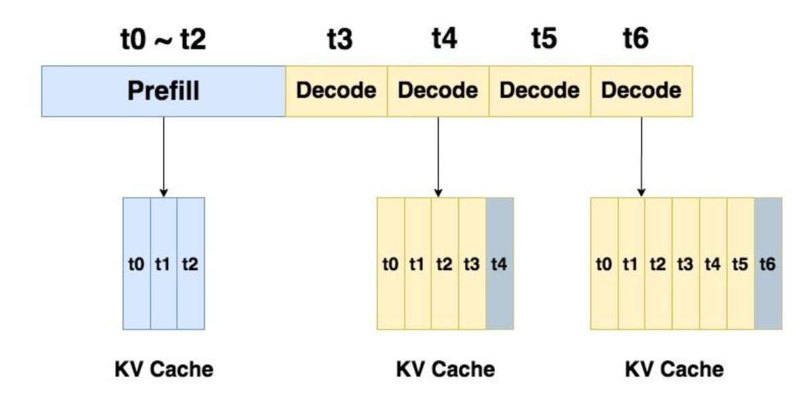
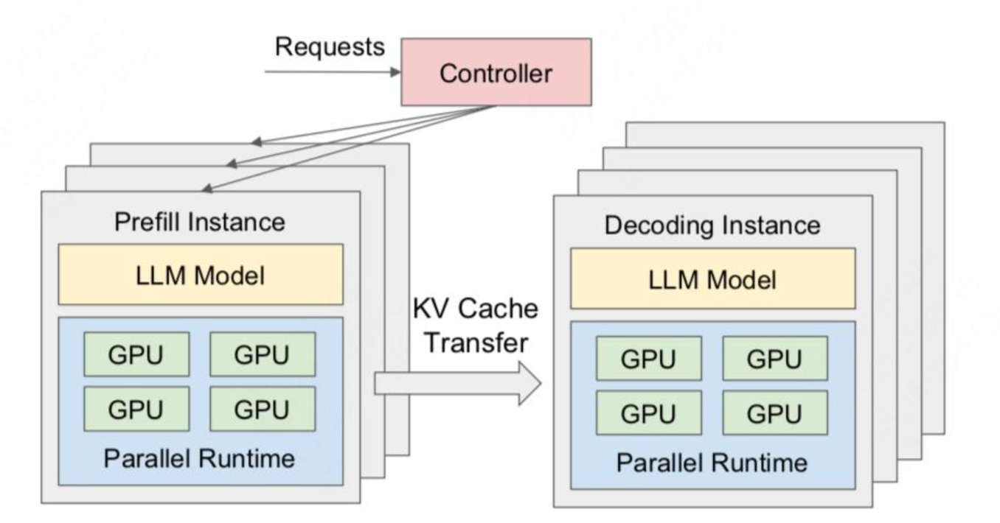

# 分离式推理架构1 - DistServe

* prefill阶段：把整段prompt喂给模型做forward计算。prefill阶段结束后，模型产出第一个token
* decode阶段：一个token一个token地产出response。

* prefill性能评估指标：TTFT
* decode性能评估指标：TPOT

## prefill和decode分离
DistServe

* SLO（人为定义的系统性能达标要求）
