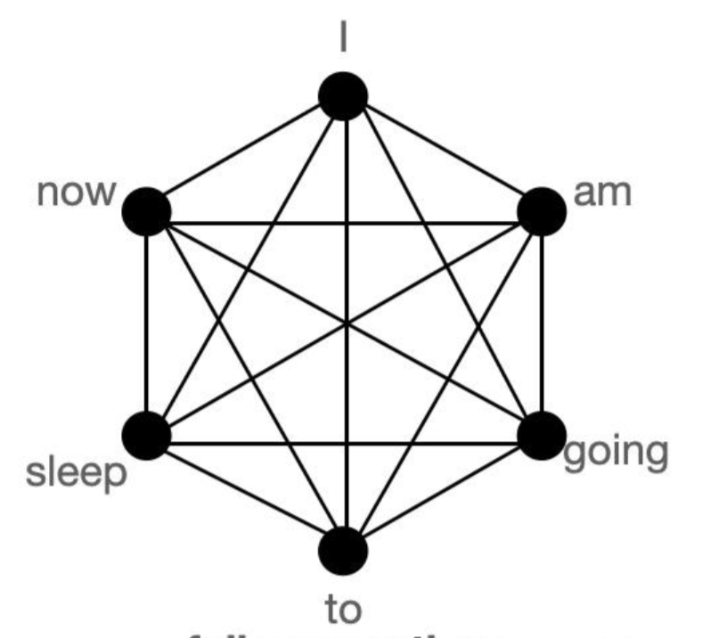

https://zhuanlan.zhihu.com/p/12481085305
# 静态丢弃 
## Big Bird

两个不同的思路：
1. 去寻找一种方法，解决上下文丢失的问题。
2. 去解决自注意力机制计算复杂度高的问题。


1. 在序列的所有部分上出现的一组（g个）全局token的集合
2. 所有与w个本地相邻token集合相关的token
3. 所有标记都属于r个随机标记的集合

* 自注意力机制的BERT



### 全局注意力

每个查询词元关注序列中的所有其他词元，并且被其他每个词元关注
假设Vasudex(第一个词元) 和them(最后一个词元) 是全局的
```
# 伪代码
Q -> Query martix (seq_length, head_dim)
K -> Key matrix (seq_length, head_dim)

# 第一个和最后一个词元关注所有其他词元
Q[0] x [K[0], K[1], K[2], ......, K[n-1]]
Q[n-1] x [K[0], K[1], K[2], ......, K[n-1]]

# 第一个和最后一个词元也被其他所有词元关注
K[0] x [Q[0], Q[1], Q[2], ......, Q[n-1]]
K[n-1] x [Q[0], Q[1], Q[2], ......, Q[n-1]]
```
### 滑动注意力

键词元序列被复制两次，其中一份每个词元向右移动一步，另一份每个词元向左移动一步。现在，如果我们将查询序列向量乘以这 3 个序列向量，我们将覆盖所有滑动词元。计算复杂度就是O(3n) = O(n)

```
# 我们想做的
Q[i] x [K[i-1], K[i], K[i+1]] for i = 1:-1

# 高效的代码实现 (  乘法为点乘)
[Q[0], Q[1], Q[2], ......, Q[n-2], Q[n-1]] x [K[1], K[2], K[3], ......, K[n-1], K[0]]
[Q[0], Q[1], Q[2], ......, Q[n-1]] x [K[n-1], K[0], K[1], ......, K[n-2]]
[Q[0], Q[1], Q[2], ......, Q[n-1]] x [K[0], K[1], K[2], ......, K[n-1]]

# 每个序列被乘 3 词， 即 `window_size = 3`。为示意，仅列出主要计算，省略了一些计算。
```

### 随机注意力
随机注意力确保每个查询词元也会关注一些随机词元。


```
# r1, r2, r 为随机索引; 注意 r1, r2, r 每行取值不同  
Q[1] x [Q[r1], Q[r2], ......, Q[r]]
.
.
.
Q[n-2] x [Q[r1], Q[r2], ......, Q[r]]

# 不用管第 0 个和第 n-1 个词元，因为它们已经是全局词元了。
```


## StreamingLLM 
决了长文本限制和避免长文本需要缓存大量Token的内存消耗问题

Attention Sinks：因为初始token在整个序列生成过程中对所有后续token都是可见的，而后续token只能被一部分后续token看到。因此，初始token更容易被训练成注意力的焦点，即“注意力汇”


# 动态丢弃(不可召回的 KV 缓存)

## H2O
https://github.com/FMInference/H2O
任务：优化 LLM 中的 KV Cache
挑战：大部分token是不重要的，这种稀疏性影响了LLM的内存占用和推理速度


H2O提出了一种KV缓存逐出策略，动态地在最近的Token和Heavy Hitters之间保持平衡
H2O将KV缓存逐出问题形式化为一个动态子模问题，并提出了一个基于H2的贪婪算法来解决这个问题。这个算法在每个解码步骤中基于局部统计信息（即只考虑前面token的注意力分数）来保留H2，被证明与考虑未来token的注意力同样有效

## SnapKV
https://arxiv.org/pdf/2404.14469
SnapKV的核心思想是发现在模型的每个注意力头中，有一些特定的提示注意力特征在生成过程中始终保持关注。
SnapKV通过自动压缩KV缓存，选择每个注意力头的聚集重要KV位置

* SnapKV的工作流程
1. 观察窗口定位：
我们首先确定提示的“观察窗口”（Lobs），假设这是提示的最后128个单词。
2. 前缀和观察窗口的分割：
将提示分为“前缀”（Lprefix）和“观察窗口”（Lobs），例如，如果提示长度为1000个单词，我们可以将最后128个单词作为观察窗口，剩下的872个单词作为前缀。
3. 投票机制：
在观察窗口中，模型会计算每个单词的注意力权重，并通过投票机制选出最重要的k个前缀位置。假设k是32，这意味着我们将从前缀中选出32个最重要的单词位置。
4. 压缩KV缓存：
然后，SnapKV将这32个重要位置的单词和观察窗口中的128个单词结合起来，形成一个新的、更小的KV缓存，这个缓存将被用于生成回复。


# 全注意力动态稀疏(针对Attention算子，prefill/decode都可用)

## Deja Vu
https://arxiv.org/pdf/2310.17157
提出了“上下文稀疏性”（contextual sparsity）的概念
对于给定输入，只有一小部分注意力头（attention heads）和多层感知器（MLP）参数是必要的，以产生与完整模型大致相同的输出

* 上下文稀疏性预测
1. MLP块的稀疏性预测
对于多层感知器（MLP）块，DEJAVU使用一个小型的两层全连接网络（即前瞻性预测器）来预测哪些神经元或权重列将对当前输入最重要。这个预测基于输入与权重向量之间的内积，可以看作是一个近似最大内积（MaxIP）问题。
2. 注意力块的稀疏性预测
对于注意力（Attention）块，DEJAVU同样使用前瞻性预测器来预测哪些注意力头将对当前输入最重要。这个预测基于注意力头参数与输入之间的相似性

* 前瞻性预测器（lookahead predictors）
给定当前层的输入，预测器会异步地预测下一层的上下文稀疏性，即预测哪些注意力头（attention heads）或MLP参数将被需要

## SParQ
https://arxiv.org/pdf/2312.04985


* 确定超参数
确定两个重要的超参数：r和k。r代表在第一步中从查询向量（query vector）中选择的最大组件数，而k代表在第二步中基于近似注意力分数选择的顶部位置的数量。

* 近似注意力分数计算（Step 1）
从查询向量（Q）中找到绝对值最大的r个组件的索引。
仅提取对应这些索引的键向量（K）的维度。
使用这些缩减的查询和键向量来计算近似的注意力分数（ˆs）。
假设Q = [0.5, -3.2, 1.1, -0.4, 2.8]，r = 3。绝对值最大的三个组件是-3.2, 2.8和1.1。
* 选择顶部位置（Step 2）
根据近似的注意力分数，选择分数最高的k个位置。
提取这些位置对应的完整的键和值向量（K和V）。

* 计算注意力输出（Step 3）
使用顶部k个键和值向量来计算注意力操作的输出。
估计顶部k个位置的总分数（α），并使用这个总分数在顶部k个位置的注意力输出和一个均值向量（V_mean）之间进行插值。


# 全缓存动态丢弃(可召回的 KV 缓存)
## Quest

https://arxiv.org/pdf/2406.10774

随着对长上下文LLMs需求的增加，模型的上下文窗口已经扩展到128K或1M个token。   
。然而，长上下文LLMs的推理速度会随着序列长度的增加而显著下降，这主要是由于在自注意力（self-attention）阶段需要加载大量的KV缓存。
以往的研究表明，一小部分关键token在注意力结果中占主导地位，但文章观察到token的关键性高度依赖于查询（query）。

* quest
Quest算法通过跟踪KV缓存页面中的最小和最大Key值，并使用查询向量来估计给定页面的关键性，从而只加载Top-K个关键KV缓存页面进行注意力计算

以下是为什么要使用最小值和最大值的原因：
1. 确定上下界
2. 近似最高注意力权重

* 例如
Token A: Key = 2
Token B: Key = -1
Token C: Key = 3
Token D: Key = 0


对于最小Key值：U_min = Q * Min Key = 2 * (-1) = -2
对于最大Key值：U_max = Q * Max Key = 2 * 3 = 6


## RetrievalAttention
https://arxiv.org/pdf/2409.10516
基于动态稀疏注意力的长文本LLM推理加速方法

该方法将大部分键值向量卸载到 CPU 内存，并通过向量搜索实现动态稀疏注意力机制，从而在保证准确性的同时显著降低了计算成本和 GPU 内存占用


现有的加速长上下文 LLM 推理的尝试集中于利用注意力稀疏性来压缩 KV 缓存大小。通常会导致精度显着下降。

FlexGen 和 Lamina，将 KV 缓存卸载到 CPU 内存，但在缓慢且成本高昂的全注意力计算方面面临挑战
Quest 和 InfLLM，将 KV 缓存划分为块并选择代表性关键向量，但其有效性在很大程度上取决于这些代表的准确性
SparQ、InfiniGen 和 LoKi 尝试通过减少头维度来逼近最相关的 top-k 键。

* RetrievalAttention

一种旨在加速长上下文 LLM 生成的创新方法
1. 在 token 生成期间采用动态稀疏注意力，允许从广泛的上下文数据中出现最关键的 token
2. 为了解决 out-of-distribution (OOD) 挑战，RetrievalAttention 引入了一个专门为注意力机制量身定制的向量索引，专注于查询分布而不是关键相似性

3. RetrievalAttention 还通过在 GPU 内存中保留少量遵循静态模式的 KV 向量来优化 GPU 内存消耗，同时将大部分 KV 向量卸载到 CPU 内存以进行索引构建
4. token 生成期间，它使用 CPU 上的向量索引有效地检索关键 token，并合并来自 CPU 和 GPU 的部分注意力结果


RetrievalAttention 采用 CPU-GPU 协同执行策略来加速长上下文 LLM 推理的注意力计算
该方法将注意力计算分解为两组不相交的 KV 缓存向量：GPU 上的可预测向量和 CPU 上的动态向量。

它利用在预填充阶段观察到的模式来预测 token 生成期间持续激活的 KV 向量，并将它们保留在 GPU 缓存中。当前的实现使用固定的初始 token 和上下文的最后一个滑动窗口作为静态模式，类似于 StreamingLLM。

对于 CPU 端计算，RetrievalAttention 构建了一个注意力感知向量搜索索引，以有效地检索相关的 KV 向量。该索引是使用从查询向量到关键向量的 KNN 连接构建的，然后将其投影到关键向量上以简化搜索过程。


RetrievalAttention 在组合 CPU 和 GPU 组件的注意力结果之前独立计算它们，其灵感来自 FastAttention。

## Post-Training Sparse Attention with Double Sparsity

https://arxiv.org/abs/2310.17157


旨在解决大型语言模型（LLMs）在推理过程中速度慢和内存密集的问题，特别是减少关键值（KV）缓存访问
Double Sparsity结合了令牌稀疏性和通道稀疏性，通过仅使用重要的令牌和特征通道来计算自注意力

* Double Sparsity
1. 模型同样接收一个包含1000个词的序列。
2. 通过离线校准，Double Sparsity识别出对于每个词来说最重要的特征通道，假设我们发现只有16个通道是重要的。
3. 在运行时，模型只关注这些重要的通道，而不是所有通道，从而减少了对KV缓存的访问。
4. 进一步地，Double Sparsity还识别出序列中最重要的词（令牌），假设我们发现只有64个词是重要的。
5. 模型只计算这64个重要词的注意力权重，而不是所有1000个词。


* 离线校准过程

1. 在模型训练完成后，我们选择一个小的验证集，比如包含100个句子的集合。
2. 我们运行模型，让模型处理这个验证集，并记录每个特征通道对模型输出的贡献度。
3. 通过分析，我们发现在这些计算中，只有20%的特征通道对模型的最终决策有显著影响。
4. 我们标记这些重要的通道，并记录它们的索引或标识。


## ClusterKV

https://arxiv.org/pdf/2412.03213
现有的KV缓存压缩方法要么永久性地驱逐令牌（tokens），要么以页面为单位召回先前的令牌，这两种方法都会降低模型的准确性和输出质量


ClusterKV通过在语义空间中对令牌进行聚类，然后仅计算与聚类表示相关的注意力权重，而不是单个令牌，从而显著减少召回开销。
论文提出了一个简单的K-means算法来对键向量进行聚类，并在聚类基础上进行选择，以确定对给定查询最重要的令牌。


* 算法
1. ClusterKV在预填充（prefill）阶段在GPU上处理键张量，生成聚类中心和相应的元数据，并将生成的KV张量卸载到CPU内存。
2. 在解码阶段，根据查询向量和聚类中心的注意力权重来确定每个聚类的重要性，并使用这些结果以及聚类元数据来生成选定令牌的索引。
3. ClusterKV还维护了一个在GPU上的聚类粒度缓存，以存储选定令牌的KV，减少从CPU内存到GPU内存的不必要数据传输，提高性能。


## LORC（Low-Rank Compression for LLMs KV Cache with a Progressive Compression Strategy）

现有的方法包括在模型升级阶段集成高效的注意力变体，这需要大量的参数调整，不适合预训练的LLMs。
测试时的KV缓存压缩主要通过令牌驱逐策略实现，这些方法通常忽视了层间的依赖关系，可能是任务特定的。

* LORC方法
1. 提出了一种基于KV权重矩阵的低秩近似方法，允许与现有的基于变换器的LLMs插件集成，无需模型重新训练。
2. 通过调整层间敏感性并引入渐进式压缩策略，有效压缩KV缓存。
3. 该方法不需要在升级阶段进行模型调整或在测试阶段进行任务特定的分析。


* 低秩近似
我们发现，很多书籍（KV向量）之间存在相似性（低秩特性），这意味着我们可以用更少的书籍来代表它们。
例如，如果我们有100本书，但它们都是10本不同书籍的副本，那么我们只需要记住这10本不同的书籍，而不是100本。

* 渐进式压缩策略
我们不是简单地从每个书架上移除相同数量的书籍，而是根据每个书架的重要性来决定保留多少书籍。
比如，靠近入口的书架（浅层）可能更常用，所以我们保留更多的书籍；而深入图书馆的书架（深层）可以保留较少的书籍，因为它们不常被访问。

* 理论分析
我们分析了如果从某个书架上移除太多书籍，可能会影响后续书架上书籍的查找效率（误差传播）。
因此，我们根据每个书架的重要性（累积条件数）来决定压缩的程度


通过SVD分解来压缩KV缓存，并通过渐进式压缩策略在不同层级上应用不同程度的压缩，以平衡模型性能和内存效率。


SVD，即奇异值分解（Singular Value Decomposition），是一种在线性代数中用于分解矩阵的数学技术。它将一个矩阵分解为一系列特定的矩阵乘积

